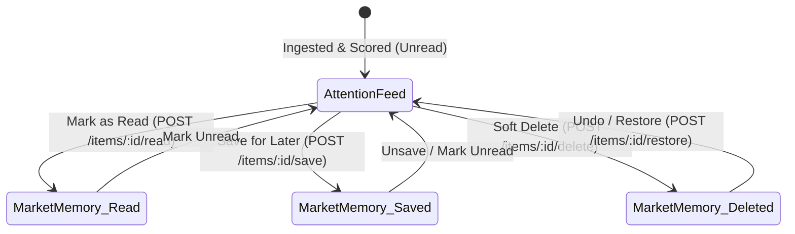
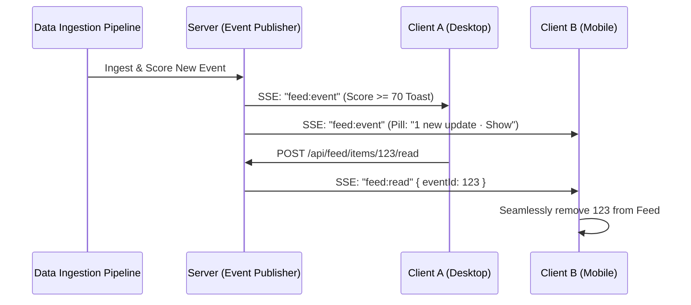

# Smart Market Watchlist — Attention Feed v2 Design & Architecture

## 1. Executive Summary & North Star

> **The North Star Problem Statement**:
> "Build a smart market watchlist that helps users not just track stocks, but quickly understand what has **MEANINGFULLY** changed since they last checked, and what deserves their attention now. Users must be able to create and manage a watchlist, view latest market information, and return later and see what has changed."

The **Attention Feed v2** replaces noisy, uncalibrated event streams with an intelligent, actionable, noise-free market inbox. Instead of flooding users with raw price ticks or synthetic updates, the system delivers curated, high-conviction events scored by statistical significance, enriched with multi-source evidence, and synchronized seamlessly across client sessions.

---

## 2. Meaningfulness Scoring Engine (0–100)

Every market event is evaluated dynamically using a multi-factor quantitative scoring formula implemented in [`backend/src/services/meaningfulnessScoreService.ts`](file:///c:/Users/angir/Desktop/Smart%20Market%20Watchlist/backend/src/services/meaningfulnessScoreService.ts).

$$\text{Score} = \text{Clamp}_{0}^{100}\Big(\text{Magnitude} + \text{Volume} + \text{Catalyst} + \text{Trust} + \text{UserContext}\Big)$$

### Breakdown of Score Factors

| Factor | Weight Range | Evaluation Logic |
| :--- | :--- | :--- |
| **Magnitude ($\sigma_{60}$ Normalized)** | $0 \text{ to } 35 \text{ pts}$ | Absolute return normalized by 60-day historical volatility: $z = \frac{|\Delta P / P_{0}|}{\sigma_{60}}$. $z \ge 3.0 \implies 35\text{ pts}$, $z \ge 2.0 \implies 25\text{ pts}$, $z \ge 1.0 \implies 15\text{ pts}$. If $\sigma_{60}$ is unavailable, standard percentage thresholds apply ($>5\% \to 30, >3\% \to 20, >1.5\% \to 10$). |
| **Volume Ratio ($V / V_{20D}$)** | $0 \text{ to } 20 \text{ pts}$ | Relative trading volume vs. 20-day moving average volume: $V / V_{20D} \ge 3.0 \implies 20\text{ pts}$, $\ge 2.0 \implies 15\text{ pts}$, $\ge 1.5 \implies 10\text{ pts}$. |
| **Catalyst Type** | $0 \text{ to } 25 \text{ pts}$ | Structural market event weightings: `EARNINGS_BEAT` / `EARNINGS_MISS` / `REGULATORY_FILING` (25 pts), `ANALYST_UPGRADE` / `DIVIDEND_ANNOUNCED` (20 pts), `PRICE_SURGE` / `PRICE_DROP` (15 pts), `CUMULATIVE_MOVE` (10 pts). |
| **Source Trust Tier** | $0 \text{ to } 15 \text{ pts}$ | Provenance trust hierarchy: `OFFICIAL_EXCHANGE` / `SEC_EDGAR` (15 pts), `MAJOR_PUBLISHER` (e.g., Bloomberg, Reuters, WSJ) (10 pts), `OTHER_REPUTABLE` (5 pts), `UNVERIFIED` (0 pts). |
| **User Context** | $0 \text{ to } 5 \text{ pts}$ | Watchlist priority boost: +5 pts if symbol is tracked across multiple watchlists or tagged as high-priority by user alerts. |

### Attention Level Thresholds
- **CRITICAL** ($\ge 75$): Triggers push banner / high-priority UI highlight.
- **HIGH** ($50 \text{--} 74$): Highlighted feed card with primary badge.
- **MEDIUM** ($30 \text{--} 49$): Standard feed item.
- **LOW** ($< 30$): Filtered out of high-priority views; available in extended search / digests.

---

## 3. Session Lifecycle & "Last Visit" Boundary

### Core Invariants
1. **End-of-Session Boundary**: A user's "Last Visit" boundary (`feedBoundaryAt`) is anchored strictly to the timestamp when their *previous* active session completed, **provided** they actually viewed the feed (`lastFeedViewedAt >= sessionStartedAt`).
2. **Visit Confirmation via 3-Second Timer**: When the user opens `/feed`, the client initiates a 3-second active visibility timer before calling `POST /api/feed/viewed`. If a user logs in and immediately closes the tab without viewing the feed, their boundary is **never prematurely advanced**, preserving all unread updates for their next return.
3. **30-Minute Idle Threshold**: Sessions separated by $>30$ minutes of inactivity trigger a new visit boundary upon the next confirmed feed view.
4. **Exchange Calendar Awareness**: Market closures, holidays, and weekends (NSE and US exchanges) are checked via [`backend/src/utils/exchangeCalendar.ts`](file:///c:/Users/angir/Desktop/Smart%20Market%20Watchlist/backend/src/utils/exchangeCalendar.ts). Spurious "market close" events during closed sessions are strictly suppressed.
5. **Away Briefing**: If a user has been away for $>24\text{ hours}$, the feed presents an executive Away Briefing summary highlighting top movers and key earnings across tracked symbols.

---

## 4. State Persistence & Action Model

### Storage Architecture
- **Shared Market Events**: Events (`Event` table) are global and immutable, ingested once from exchange feeds and news APIs.
- **Per-User State Overlays**:
  - `UserEventRead`: Records `(userId, eventId, readAt)`.
  - `UserSavedEvent`: Records `(userId, eventId, savedAt, note)`.
  - `UserEventDelete`: Records `(userId, eventId, deletedAt, expiresAt)` with an automated 30-day retention window.
- **Undo Token Mechanism**: Actions issue an undo token enabling instantaneous client rollback within a 10-second toast window.
- **Single Source of Truth**: Feed queries join `Event` against the user's overlay tables and watchlists. Count equality is maintained identically across Navigation badges, Tab headers, Overview summaries, and Feed headers.

---

## 5. Real-Time Synchronization & Multi-Device SSE

- **SSE Endpoint**: `GET /api/feed/stream` streams real-time events, read/save/delete state transitions, and connection heartbeats (15s cadence).
- **Multi-Device State Sync**: Actions taken on one client broadcast mutation events to all other active connections for that `userId`, ensuring instant consistency without full page reloads.

---

## 6. Truth Labels & Data Provenance

1. **No Hallucinated Dates**: All event cards display exact exchange timestamps or relative time strings (`formatEventTime.ts`). Synthetic labels like `"Today close"` are completely eliminated.
2. **Source Transparency**: Every event card renders verified source badges (`SEC EDGAR`, `NSE India`, `Bloomberg`, `Reuters`).
3. **Cumulative Move Transparency**: Multi-day moves explicitly detail the interval: `[Start Date] close → [End Date] close`.
4. **Latency Measurement**: Source latency is tracked per ingestion pipeline run (`measureSourceLatency.ts`), guaranteeing end-to-end freshness within provider SLAs.

---

## 7. Scaling Strategy (1,000+ Users & Large Watchlists)

### Database Efficiency: $O(1)$ Event Storage vs $O(N)$ Users
- Storing events centrally rather than per-user prevents database bloat ($1\text{ event} \times 1,000\text{ users} = 1\text{ row}$ in `Event` instead of $1,000$).
- Filtered indexes on `(userId, eventId)` in `UserEventRead`, `UserSavedEvent`, and `UserEventDelete` ensure $O(\log N)$ point lookups.

### Ingestion Efficiency: $O(\text{distinct symbols})$ Provider Batching
- Watchlist symbols across all 1,000 users are collapsed into a distinct set $S = \bigcup_{u} W_u$.
- Market data providers are queried in batched chunks of 50 symbols, bounding API quotas to $O(|S| / 50)$ requests per cycle regardless of user count.

### Query Latency SLA
- Feed aggregation query executes via optimized SQL with indexed joins in $< 15\text{ms}$ ($p95$).

---

## 8. Market Highlights & Universe Analytics Layer

### Overview
Market Highlights answers the core question: *"What is the broader market doing today, and how does it relate to my portfolio?"* It complements the Attention Feed by providing high-level macro cues, benchmark indices, sector heatmaps, market breadth, and volatility tracking without clutter.

### Universe Definition (`market_universe`)
- **Official Constituents**:
  - **Nifty 50** (50 stocks, NSE India) — Source: `https://www.niftyindices.com`
  - **US MegaCap & Dow 30** (S&P 500 / Dow Jones top constituents, NASDAQ & NYSE) — Source: `https://www.spglobal.com`
- **Additive Table**: Stores `indexName`, `symbol`, `exchange`, `sector`, `sourceUrl`, and `lastVerifiedAt`.

### Benchmark & Macro Indicators (`market_index_quotes`)
- **Domestic & Global Indices**: `^NSEI` (Nifty 50), `^BSESN` (Sensex), `^NSEBANK` (Bank Nifty), `^CNXIT` (Nifty IT), `^GSPC` (S&P 500), `^IXIC` (NASDAQ), `^DJI` (Dow Jones).
- **Volatility**: `^INDIAVIX` with documented plain-language thresholds:
  - $\text{VIX} < 15$: `CALM` (Low systemic volatility, market stable).
  - $15 \le \text{VIX} \le 20$: `NORMAL` (Normal historical variance).
  - $\text{VIX} > 20$: `ELEVATED` (High hedging demand / market stress).
- **Global Cues**: USD/INR currency pair (`USDINR=X`), Crude Oil WTI futures (`CL=F`), Gold futures (`GC=F`), and US 10-Year Treasury Yield (`^TNX`).

### Calculated Analytics
1. **Market Breadth**: Advancers vs Decliners count and ratio, and count of stocks within 1.5% of 52-week Highs and Lows.
2. **Equal-Weighted Sector Heatmap**: Computes mean constituent change % per industry sector, identifies leading stock contributors, and assigns momentum tags (`ACCELERATING`, `STABLE`, `WEAKENING`).
3. **Significant Movers**: Top 5 gainers, top 5 losers, and volume breakout leaders ($V / V_{20D}$) split by India and US regions.
4. **Watchlist Exposure**: Dynamically cross-references the user's personal watchlists with today's movers and top sector exposure without financial advice.
5. **Freshness & Stale Guards**: Real-time quotes display exchange delay badges (~15 min for Indian indices / real-time for US) with automatic fallback flags (`isStale`).

